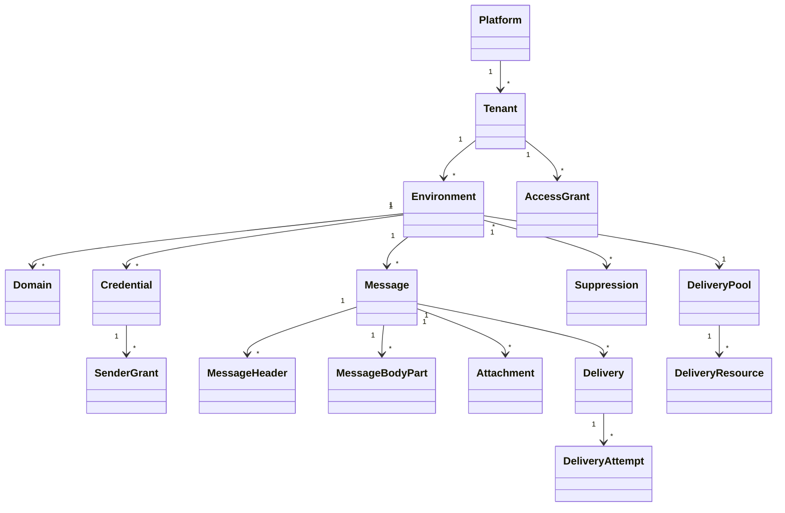

# Domain Model

## Ownership

- Tenant is the primary isolation boundary.
- Environment owns message-sending configuration.
- Domain and Credential belong to an Environment.
- Sender Grants belong to a Credential.
- Message belongs to an Environment.
- MessageHeader preserves ordered, repeatable submitted headers and any normalized query projection.
- MessageBodyPart stores body content and semantic MIME metadata relationally.
- Attachment stores metadata and an opaque reference to attachment bytes in Blob/Object Storage.
- Delivery belongs to a Message and represents one recipient.
- Delivery Attempt belongs to a Delivery.
- Suppression initially belongs to an Environment.
- Delivery Pool is platform-managed and authorized to Tenants.

## Quota accounting

Usage originates from accepted recipient Deliveries at Environment level and is also aggregated into the parent Tenant quota window.

Message, its envelope, headers, bodies, attachment references, quota consumption and all recipient Deliveries share one relational acceptance transaction. Durable attachment upload precedes that transaction and is reconciled separately if the relational transaction does not commit. Messages without attachments have no Blob/Object Storage dependency.

## Authorization

Access Grants target resources and assign a role. Effective access is computed using direct grants, inherited grants and Tenant administration.
