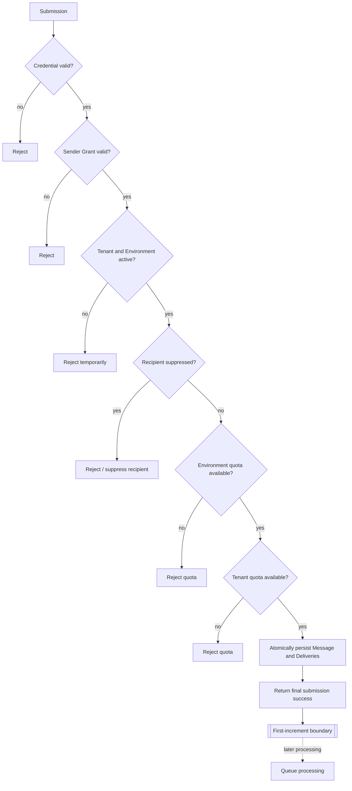
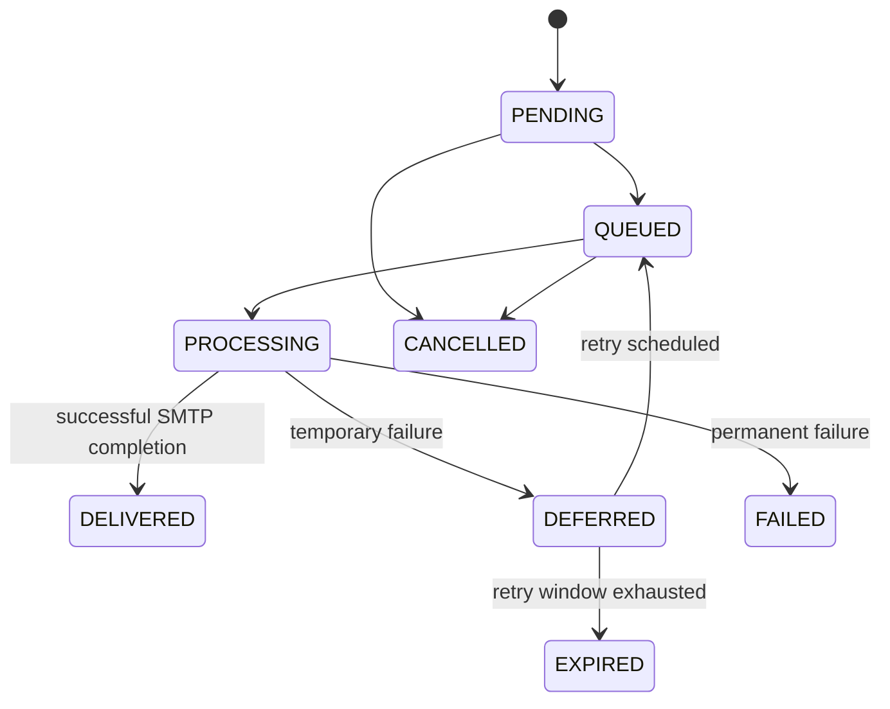

# Message Lifecycle

## Submission lifecycle

The acceptance transaction creates exactly one unqueued Delivery for every accepted envelope recipient. Queue processing begins only after the successful SMTP submission boundary.

## Delivery lifecycle

A Message may contain Deliveries in different states simultaneously. Message-level state is therefore an aggregate view rather than the source of truth for recipient delivery outcome.
