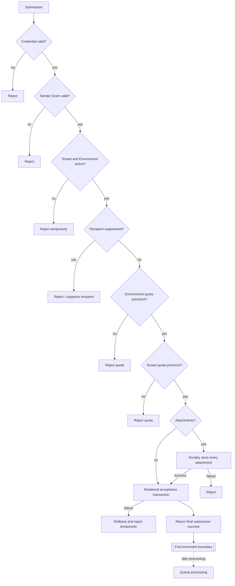
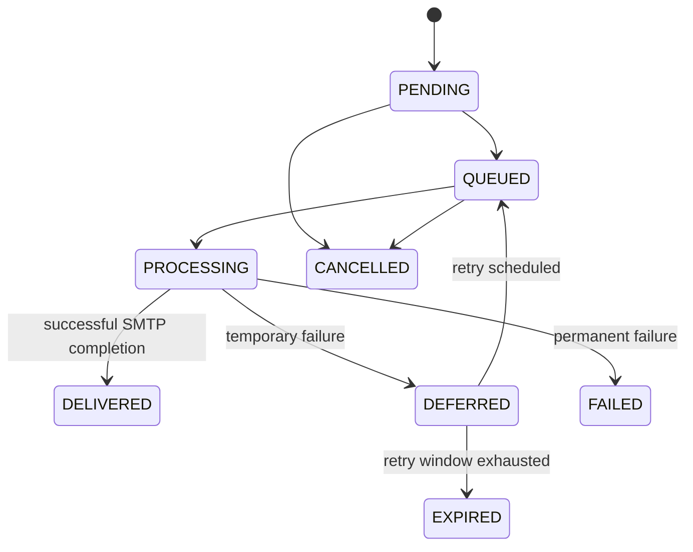

# Message Lifecycle

## Submission lifecycle

The acceptance transaction stores the envelope, headers, body, metadata and attachment references and creates exactly one unqueued Delivery for every accepted envelope recipient. An attachment uploaded before a failed relational transaction is an unreachable orphan handled by safe reconciliation. Messages without attachments use no Object Storage operation. Queue processing begins only after the successful SMTP submission boundary.

If relational commit succeeds but the client does not observe the final SMTP reply, the accepted Message remains valid. A retransmission is a separate submission and may create another Message under the at-least-once semantics in ADR-0013.

## Delivery lifecycle

A Message may contain Deliveries in different states simultaneously. Message-level state is therefore an aggregate view rather than the source of truth for recipient delivery outcome.
