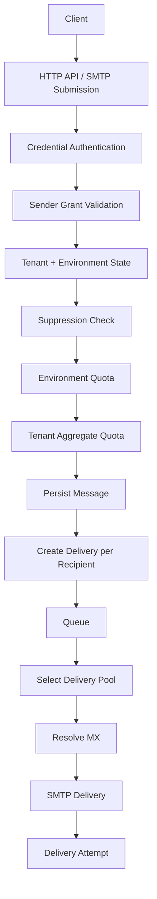

# Architecture Overview

This document captures the current logical architecture. It is intentionally technology-neutral while requirements are still evolving.

## Core flow

## Main boundaries

### Control plane

Responsible for Tenant, Environment, Domain, Credential, ACL, quota configuration and Delivery Pool configuration.

### Submission plane

Accepts authenticated HTTP API and SMTP submissions and performs validation before queue admission.

### Delivery plane

Processes Deliveries asynchronously, applies routing, resolves destination MX hosts, performs SMTP delivery and schedules retries.

### Observability plane

Provides message history, Delivery Attempts, usage metrics and dashboards.

## Design principles

- Tenant isolation is mandatory.
- Delivery outcome is per recipient.
- Quotas are hierarchical.
- Authentication and sender authorization are separate concerns.
- Delivery Pools abstract outbound routing resources.
- Protocol replies, not free-form response text, drive SMTP retry semantics.
