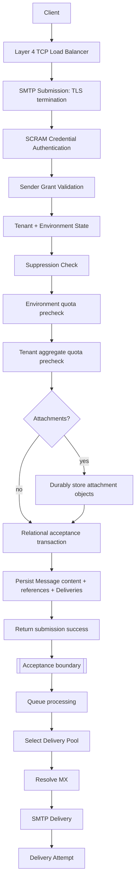

# Architecture Overview

This document captures the current logical architecture. It is intentionally technology-neutral while requirements are still evolving.

## Core flow

The first increment ends at the acceptance boundary. Message envelope, headers, bodies and metadata are relational. When attachments exist, final SMTP success depends on durable attachment storage followed by atomic relational persistence of quota consumption, Message data, attachment references and one unqueued Delivery per accepted recipient. Messages without attachments do not depend on Object Storage. Acceptance does not depend on queue processing or outbound delivery.

See [SMTP Submission Architecture](smtp-submission.md) for the security, persistence, concurrency, configuration and failure boundaries of Story #4.

## Main boundaries

### Control plane

Responsible for Tenant, Environment, Domain, Credential, ACL, quota configuration and Delivery Pool configuration.

### Submission plane

Accepts authenticated HTTP API and SMTP submissions, performs required policy validation and safely persists accepted submission data.

### Delivery plane

Processes Deliveries asynchronously, applies routing, resolves destination MX hosts, performs SMTP delivery and schedules retries.

### Observability plane

Provides message history, Delivery Attempts, usage metrics and dashboards.

## Design principles

- Tenant isolation is mandatory.
- Delivery outcome is per recipient.
- Quotas are hierarchical.
- Authentication and sender authorization are separate concerns.
- Delivery Pools abstract outbound routing resources.
- Protocol replies, not free-form response text, drive SMTP retry semantics.
- Accepted SMTP submission is at-least-once when the final reply is lost after commit.
