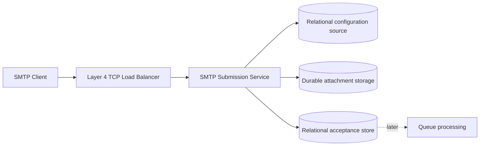
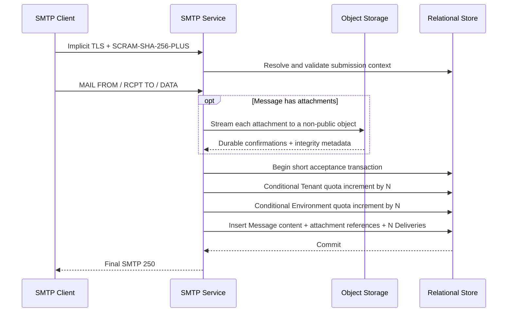

# SMTP Submission Architecture

This document applies the accepted architecture decisions for Story #4. It describes the durable acceptance boundary without selecting an implementation language, framework, database product, object-storage product or cache product.

Safe initial implementation defaults and deliberately deferred tuning parameters are documented separately in [SMTP Submission Implementation Guidelines](smtp-submission-implementation-guidelines.md).

## Component boundary

The Layer 4 load balancer does not terminate SMTP TLS. The SMTP service owns the TLS session, `SCRAM-SHA-256-PLUS` channel binding and state for the lifetime of the connection, as defined by [ADR-0008](../adr/0008-smtp-tls-termination.md).

## Credential and configuration lookup

The initial service reads Credential, active verifier version, Tenant and Environment state, limits, Sender Grants and Suppressions from the relational source of truth. It does not require Redis or a synchronous Control Plane service call.

Authentication uses the non-recoverable verifier representation from [ADR-0009](../adr/0009-smtp-scram-credential-verifiers.md). Before final acceptance, the service revalidates security-sensitive state so rotation, revocation or resource-state changes made after authentication cannot be ignored by a long-lived session.

If authoritative configuration cannot be read, submission fails closed with a temporary SMTP failure. A future cache or materialized read model must preserve this behavior and the consistency rules in [ADR-0012](../adr/0012-submission-configuration-consistency.md).

## Durable acceptance sequence

Every required attachment upload completes before the relational transaction starts. Messages without attachments skip Object Storage. No network call occurs inside the transaction. Final success is returned only after all attachment writes and the relational commit succeed.

Quota checks before attachment upload are advisory prechecks that avoid unnecessary object writes. The conditional counter updates inside the relational transaction are authoritative. A race after precheck can therefore leave orphan attachments when the transaction later finds insufficient quota; reconciliation handles them like other unreferenced objects.

The relational Message representation contains the SMTP envelope, ordered and repeatable headers, body parts and their content metadata, submission metadata and attachment references. It preserves message semantics but does not initially promise byte-for-byte reconstruction of the submitted raw MIME stream.

## Relational acceptance transaction

For `N` accepted recipients, the transaction:

1. verifies the effective quota configuration;
2. conditionally consumes `N` Tenant quota units;
3. conditionally consumes `N` Environment quota units;
4. creates one Message with envelope, headers, bodies and durable attachment references;
5. bulk-creates exactly `N` `PENDING` Deliveries;
6. commits or rolls back the complete relational outcome.

All callers use the same counter-update order. Constraint, deadlock or serialization conflicts receive bounded retry with jitter. A failed or exhausted transaction produces no accepted Message and returns a temporary SMTP failure.

The exact-counter strategy and its alternatives are recorded in [ADR-0011](../adr/0011-concurrent-quota-acceptance.md). Its hot-row behavior requires the linked concurrency benchmark before production readiness.

## Cross-store failure handling

Blob/Object Storage and the relational store do not participate in a distributed transaction.

- A parse or attachment-upload failure produces no relational acceptance.
- A relational failure after attachment upload can leave unreferenced orphan objects.
- A safe, idempotent reconciler removes only unreferenced objects older than a safety horizon.
- A committed reference to a missing or corrupt attachment is an integrity incident and must block later processing of the affected Message.

The complete policy is defined by [ADR-0010](../adr/0010-message-and-attachment-persistence.md). Preserving the complete raw MIME in addition to the relational representation remains explicitly deferred for separate review.

## Ambiguous final reply

If commit succeeds but the connection fails before the client observes `250`, the Message remains accepted. A retransmission may create another Message and Delivery set. Client `Message-ID` and content hash are correlation data, not deduplication keys.

Internal retries remain idempotent by Velaris identifiers. [ADR-0013](../adr/0013-smtp-at-least-once-submission.md) distinguishes internal idempotency from deduplication of independent client transactions.

## Observability

Telemetry must correlate the SMTP session, Credential, Tenant, Environment, Message and Deliveries without logging reusable secrets or MIME content. The acceptance path must expose at least:

- TLS version and authentication mechanism result;
- submission result and SMTP response class;
- accepted recipient count and created Delivery count;
- attachment count, object-write duration and attachment bytes;
- relational transaction duration and outcome;
- quota contention, conflicts and retry count;
- orphan-reconciliation and content-integrity failures.

## Traceability

- Story #4 — Accept and persist authenticated SMTP submission
- RF-SUB-001 through RF-SUB-011
- RF-CRE-003, RF-CRE-004, RF-CRE-010, RF-CRE-012 and RF-CRE-014
- RF-MSG-005 and RF-MSG-006
- RF-QUO-001 through RF-QUO-007
- RF-SUP-003
- RNF-AUT-008, RNF-AUT-009 and RNF-AUT-011
- RNF-ARC-002, RNF-ARC-003 and RNF-ARC-006
- RNF-CAP-001 and RNF-CAP-006
- RNF-DB-006, RNF-DB-008, RNF-DB-009 and RNF-DB-012
- RNF-OBS-001 through RNF-OBS-005 and RNF-OBS-009
